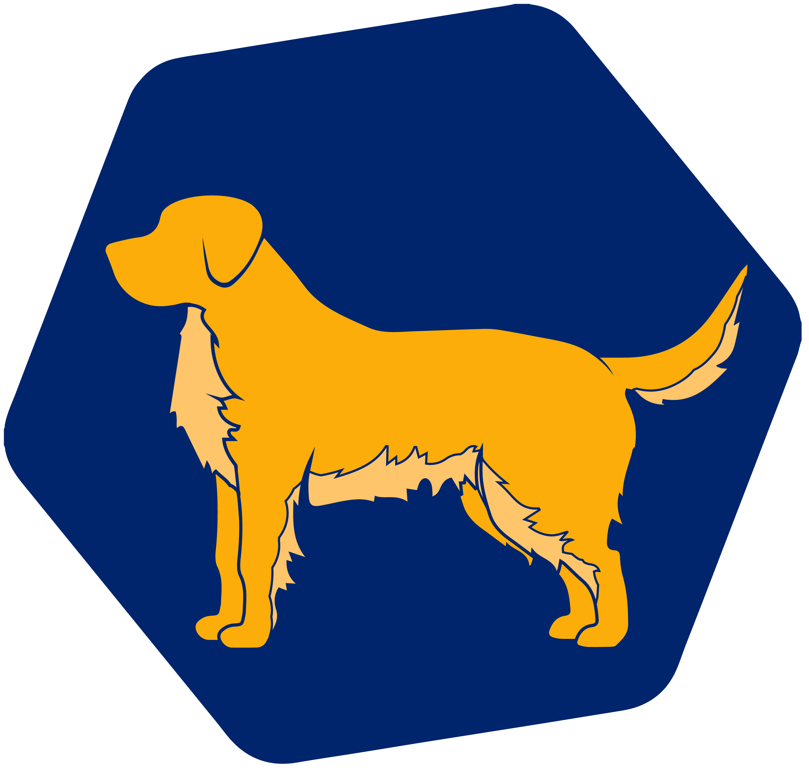

<div align="center">
  <h1>Cherche</h1>
  <p>Neural search</p>
</div>

<p align="center"></p>

<div align="center">
  <!-- Documentation -->
  <a href="https://raphaelsty.github.io/cherche/"></a>
  <!-- Demo -->
  <a href="https://raphaelsty.github.io/knowledge/?query=cherche%20neural%20search"></a>
  <!-- License -->
  <a href="https://opensource.org/licenses/MIT"></a>
</div>


Cherche enables the development of a neural search pipeline that employs retrievers and pre-trained language models both as retrievers and rankers. The primary advantage of Cherche lies in its capacity to construct end-to-end pipelines. Additionally, Cherche is well-suited for offline semantic search due to its compatibility with batch computation.

[Live demo of a NLP search engine powered by Cherche](https://raphaelsty.github.io/knowledge/?query=cherche%20neural%20search)


## Installation 🤖

To install Cherche for use with a simple retriever on CPU, such as TfIdf, Flash, Lunr, Fuzz, use the following command:

```sh
pip install cherche
```

To install Cherche for use with any semantic retriever or ranker on CPU, use the following command:

```sh
pip install "cherche[cpu]"
```

Finally, if you plan to use any semantic retriever or ranker on GPU, use the following command:

```sh
pip install "cherche[gpu]"
```

By following these installation instructions, you will be able to use Cherche with the appropriate requirements for your needs.

### Documentation

Documentation is available [here](https://raphaelsty.github.io/cherche/). It provides details
about retrievers, rankers, pipelines and examples.

## QuickStart 📑

### Documents

Cherche allows findings the right document within a list of objects. Here is an example of a corpus.

```python
from cherche import data

documents = data.load_towns()

documents[:3]
[{'id': 0,
  'title': 'Paris',
  'url': 'https://en.wikipedia.org/wiki/Paris',
  'article': 'Paris is the capital and most populous city of France.'},
 {'id': 1,
  'title': 'Paris',
  'url': 'https://en.wikipedia.org/wiki/Paris',
  'article': "Since the 17th century, Paris has been one of Europe's major centres of science, and arts."},
 {'id': 2,
  'title': 'Paris',
  'url': 'https://en.wikipedia.org/wiki/Paris',
  'article': 'The City of Paris is the centre and seat of government of the region and province of Île-de-France.'
  }]
```

### Retriever ranker

Here is an example of a neural search pipeline composed of a TF-IDF that quickly retrieves documents, followed by a ranking model. The ranking model sorts the documents produced by the retriever based on the semantic similarity between the query and the documents. We can call the pipeline using a list of queries and get relevant documents for each query.

```python
from cherche import data, retrieve, rank
from sentence_transformers import SentenceTransformer

# List of dicts
documents = data.load_towns()

# Retrieve on fields title and article
retriever = retrieve.TfIdf(key="id", on=["title", "article"], documents=documents, k=30)

# Rank on fields title and article
ranker = rank.Encoder(
    key = "id",
    on = ["title", "article"],
    encoder = SentenceTransformer("sentence-transformers/all-mpnet-base-v2").encode,
    k = 3,
)

# Pipeline creation
search = retriever + ranker

search.add(documents=documents)

# Search documents for 3 queries.
search(["Bordeaux", "Paris", "Toulouse"])
[[{'id': 57, 'similarity': 0.69513524},
  {'id': 63, 'similarity': 0.6214994},
  {'id': 65, 'similarity': 0.61809087}],
 [{'id': 16, 'similarity': 0.59158516},
  {'id': 0, 'similarity': 0.58217555},
  {'id': 1, 'similarity': 0.57944715}],
 [{'id': 26, 'similarity': 0.6925601},
  {'id': 37, 'similarity': 0.63977146},
  {'id': 28, 'similarity': 0.62772334}]]
```

We can map the index to the documents to access their contents using pipelines:

```python
search += documents
search(["Bordeaux", "Paris", "Toulouse"])
[[{'id': 57,
   'title': 'Bordeaux',
   'url': 'https://en.wikipedia.org/wiki/Bordeaux',
   'similarity': 0.69513524},
  {'id': 63,
   'title': 'Bordeaux',
   'similarity': 0.6214994},
  {'id': 65,
   'title': 'Bordeaux',
   'url': 'https://en.wikipedia.org/wiki/Bordeaux',
   'similarity': 0.61809087}],
 [{'id': 16,
   'title': 'Paris',
   'url': 'https://en.wikipedia.org/wiki/Paris',
   'article': 'Paris received 12.',
   'similarity': 0.59158516},
  {'id': 0,
   'title': 'Paris',
   'url': 'https://en.wikipedia.org/wiki/Paris',
   'similarity': 0.58217555},
  {'id': 1,
   'title': 'Paris',
   'url': 'https://en.wikipedia.org/wiki/Paris',
   'similarity': 0.57944715}],
 [{'id': 26,
   'title': 'Toulouse',
   'url': 'https://en.wikipedia.org/wiki/Toulouse',
   'similarity': 0.6925601},
  {'id': 37,
   'title': 'Toulouse',
   'url': 'https://en.wikipedia.org/wiki/Toulouse',
   'similarity': 0.63977146},
  {'id': 28,
   'title': 'Toulouse',
   'url': 'https://en.wikipedia.org/wiki/Toulouse',
   'similarity': 0.62772334}]]
```

## Retrieve

Cherche provides [retrievers](https://raphaelsty.github.io/cherche/retrieve/retrieve/) that filter input documents based on a query.

- retrieve.TfIdf
- retrieve.Lunr
- retrieve.Flash
- retrieve.Encoder
- retrieve.DPR
- retrieve.Fuzz
- retrieve.Embedding

## Rank

Cherche provides [rankers](https://raphaelsty.github.io/cherche/rank/rank/) that filter documents in output of retrievers.

Cherche rankers are compatible with [SentenceTransformers](https://www.sbert.net/docs/pretrained_models.html) models which are available on [Hugging Face hub](https://huggingface.co/models?pipeline_tag=zero-shot-classification&sort=downloads).

- rank.Encoder
- rank.DPR
- rank.CrossEncoder
- rank.Embedding

## Question answering

Cherche provides modules dedicated to question answering. These modules are compatible with Hugging Face's pre-trained models and fully integrated into neural search pipelines.

## Contributors 🤝
Cherche was created for/by Renault and is now available to all.
We welcome all contributions.

<p align="center"></p>

## Acknowledgements 👏

TfIdf retriever is a wrapper around [scikit-learn's TfidfVectorizer](https://scikit-learn.org/stable/modules/generated/sklearn.feature_extraction.text.TfidfVectorizer.html). Lunr retriever is a wrapper around [Lunr.py](https://github.com/yeraydiazdiaz/lunr.py). Flash retriever is a wrapper around [FlashText](https://github.com/vi3k6i5/flashtext). DPR, Encode and CrossEncoder rankers are wrappers dedicated to the use of the pre-trained models of [SentenceTransformers](https://www.sbert.net/docs/pretrained_models.html) in a neural search pipeline.

## Citations

If you use cherche to produce results for your scientific publication, please refer to our SIGIR paper:

```
@inproceedings{Sourty2022sigir,
    author = {Raphael Sourty and Jose G. Moreno and Lynda Tamine and Francois-Paul Servant},
    title = {CHERCHE: A new tool to rapidly implement pipelines in information retrieval},
    booktitle = {Proceedings of SIGIR 2022},
    year = {2022}
}
```

## Dev Team 💾

The Cherche dev team is made up of [Raphaël Sourty](https://github.com/raphaelsty), [François-Paul Servant](https://github.com/fpservant), [Nicolas Bizzozzero](https://github.com/NicolasBizzozzero), [Jose G Moreno](https://scholar.google.com/citations?user=4BZFUw8AAAAJ&hl=fr). 🥳
