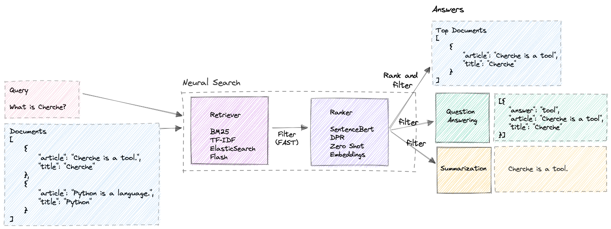

# Cherche

Cherche (search in French) allows you to create a simple neural search pipeline using retrievers and pre-trained language models as rankers. Cherche is dedicated to corpus of small to middle size.



## Installation 🤖

```sh
pip install git+https://github.com/raphaelsty/cherche
```

## QuickStart 💨

### Documents 📑

Cherche allows to find the right document within a list of JSON. Here is an example of a corpus.

```python
from cherche import data

documents = data.load_towns()

documents[:3]
[{'article': 'Paris (French pronunciation: \u200b[paʁi] (listen)) is the '
             'capital and most populous city of France, with an estimated '
             'population of 2,175,601 residents as of 2018, in an area of more '
             'than 105 square kilometres (41 square miles).',
  'title': 'Paris',
  'url': 'https://en.wikipedia.org/wiki/Paris'},
 {'article': "Since the 17th century, Paris has been one of Europe's major "
             'centres of finance, diplomacy, commerce, fashion, gastronomy, '
             'science, and arts.',
  'title': 'Paris',
  'url': 'https://en.wikipedia.org/wiki/Paris'},
 {'article': 'The City of Paris is the centre and seat of government of the '
             'region and province of Île-de-France, or Paris Region, which has '
             'an estimated population of 12,174,880, or about 18 percent of '
             'the population of France as of 2017.',
  'title': 'Paris',
  'url': 'https://en.wikipedia.org/wiki/Paris'}]
```

### Retriever ranker 🔍

Here is an example of a neural search pipeline composed of a TfIdf that quickly retrieves documents followed by a ranking model that sorts the documents at the output of the retriever based on the semantic similarity between the query and the documents.

```python
from cherche import data, retrieve, rank
from sentence_transformers import SentenceTransformer

# List of dicts
documents = data.load_towns() 

# Retrieve on field article
retriever = retrieve.TfIdf(on="article", k=30)

# Rank on field article
ranker = rank.Encoder(
    encoder = SentenceTransformer("sentence-transformers/all-mpnet-base-v2").encode,
    on = "article",
    k = 3,
    path = "encoder.pkl"
)

# Neural search pipeline
search = retriever + ranker

# Create index for documents
search.add(documents=documents)
```

```python
TfIdf retriever
  on: article
  documents: 105
Encoder ranker
  on: article
  k: 3
  similarity: cosine
  embeddings stored at: encoder.pkl
```

```python
# Relevant documents
search("capital of france")
```

```python
[{'title': 'Paris',
  'url': 'https://en.wikipedia.org/wiki/Paris',
  'article': 'Paris (French pronunciation: \u200b[paʁi] (listen)) is the capital and most populous city of France, with an estimated population of 2,175,601 residents as of 2018, in an area of more than 105 square kilometres (41 square miles).',
  'similarity': 0.69809234},
 {'title': 'Paris',
  'url': 'https://en.wikipedia.org/wiki/Paris',
  'article': 'The City of Paris is the centre and seat of government of the region and province of Île-de-France, or Paris Region, which has an estimated population of 12,174,880, or about 18 percent of the population of France as of 2017.',
  'similarity': 0.64064014},
 {'title': 'Toulouse',
  'url': 'https://en.wikipedia.org/wiki/Toulouse',
  'article': 'It is now the capital of the Occitanie region, the second largest region in Metropolitan France.',
  'similarity': 0.556991}]
```
